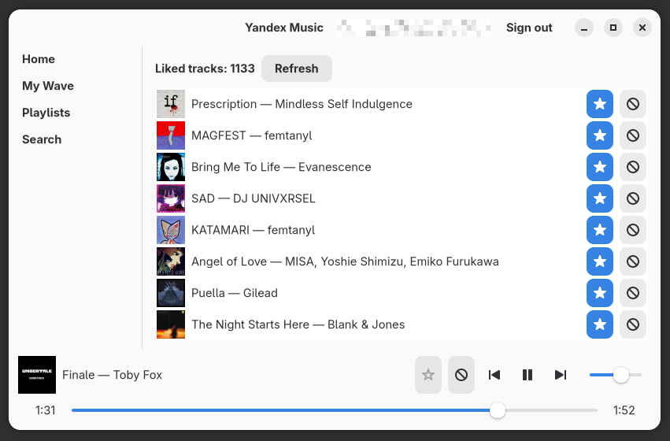

# Yandex Music — unofficial native GTK4 player

> **⚠️ IMPORTANT DISCLAIMER — THIS PROJECT IS AI-SLOP.**
>
> This entire codebase (the Rust source, this README, and every design decision
> recorded here) was produced with the assistance of an AI coding agent. It is
> not the work of a human engineering team, it has **no human review**, and it
> may contain subtle bugs, awkward architecture, incorrect API usage, or
> misunderstandings of Yandex Music's undocumented internal API. Use it at your
> own risk. If you rely on it, treat it as a starting point that needs real
> human auditing — not as a trustworthy product.
> (Human note: I wanted to build this client for my own needs so that it will be somewhat more lightweight than official. It is to be seen if that's the case really. Anyways. This project is on my GitHub just in case anyone would find it useful).

A native Linux desktop player for [Yandex Music](https://music.yandex.ru),
written in Rust with GTK4 / libadwaita and GStreamer.

It is a from-scratch reimplementation of the Yandex Music API integration and
player behaviour of the official (TypeScript/Electron) desktop client — the
*reference client* — but rendered in native GTK4 widgets instead of a web
view.

It talks to Yandex Music's **private, undocumented** web API using the same
endpoints, `client_id` and OAuth *device flow* that the official clients use.
Because that API is unofficial, there is no guarantee of stability — Yandex can
change or break it at any time.

---

## Table of contents

- [Features](#features)
- [Screenshots](#screenshots)
- [Requirements](#requirements)
- [Building](#building)
- [Running](#running)
- [First login](#first-login)
- [Using the app](#using-the-app)
- [Desktop integration (MPRIS, tray)](#desktop-integration)
- [Command-line tool (`ym-cli`)](#command-line-tool-ym-cli)
- [Headless playtest harness](#headless-playtest-harness)
- [Environment variables](#environment-variables)
- [Configuration file](#configuration-file)
- [Architecture & project layout](#architecture--project-layout)
- [The playback pipeline](#the-playback-pipeline)
- [How "My Wave" works](#how-my-wave-works)
- [Testing](#testing)
- [Known limitations](#known-limitations)
- [Security notes](#security-notes)
- [License](#license)

---

## Features

- **My Wave** — the personal infinite radio station. Pulls batches of tracks
  from the `user:onyourwave` rotor and keeps the queue going by fetching the
  next batch whenever the current one runs out. Mood/energy presets (Any,
  Energetic, Cheerful, Calm, Sad) are applied server-side.
- **Liked tracks** — your starred library, hydrated from the short reference
  objects the API returns.
- **Playlists** — browse your playlists.
- **Search** — search tracks, albums, artists and playlists.
- **Playback bar** — always-visible bar at the bottom with:
  - now-playing cover, title and artist (ellipsized),
  - like / dislike buttons (with filled/red accent states),
  - previous / play-pause / next transport buttons,
  - a seek slider with elapsed / total time,
  - a volume slider (persisted to config).
- **Infinite queue** — play one song and the rest of the list follows;
  My Wave continues into new batches automatically.
- **Double-click to play** — double-click any row in liked tracks, search
  results, or My Wave to start playback from that track.
- **MPRIS** — exposes the player on the session D-Bus as
  `org.mpris.MediaPlayer2.YandexMusic`, so media keys, `playerctl` and desktop
  media widgets can control it.
- **System tray** — a StatusNotifierItem with play/pause/next/previous and
  now-playing title.
- **OAuth device login** — sign in with a code shown in-app (or via `ym-cli
  login`), no password stored.

---

## Screenshots

The main window (player bar at the bottom, sidebar on the left):



---

## Requirements

The app is developed and tested on **Arch Linux** with the **GTK4** stack and
**GStreamer**. The exact packages:

```bash
sudo pacman -S gtk4 libadwaita gstreamer gst-plugins-base gst-plugins-good gst-libav
```

You will also need the Rust toolchain and build essentials:

```bash
sudo pacman -S base-devel rust pkg-config
```

| Component | Notes |
|-----------|-------|
| GTK4 + libadwaita | required to build the `gtk4`/`libadwaita` Rust crates (they need `gtk4.pc` via pkg-config) |
| GStreamer core + plugins | `gst-plugins-good` provides the HTTP source (`souphttpsrc`) and Pulse/PipeWire sink; `gst-libav` gives MP3/AAC decoding |
| A session D-Bus | needed for MPRIS and the system tray |
| A Wayland or X11 session | the window itself |

> **Why GStreamer?** Playback uses the `gst-play` convenience API (`gstreamer-play`
> crate), which builds a `playbin` pipeline automatically — no manual element
> graph needed. The audio sink follows the system default (PulseAudio / PipeWire).

Note: if you ever see a build failure like *"Package 'gtk4' not found"*, the
GTK4 development package is missing — install it (Arch: `sudo pacman -S gtk4
libadwaita`) and rebuild.

---

## Building

From the repository root:

```bash
cargo build                      # debug build
cargo build --release            # optimized build (LTO + stripped)
```

The crate builds three binaries:

| Binary | Purpose |
|--------|---------|
| `target/(debug\|release)/yandex-music` | the GTK4 GUI player |
| `target/(debug\|release)/ym-cli` | headless API smoke-tool (see below) |
| `target/(debug\|release)/playtest` | headless playback reproduction harness (see below) |

The GUI and the CLI share a library crate called `ymapp` (`src/lib.rs`).

Optional checks:

```bash
cargo test                       # run the unit tests (17 tests)
cargo clippy --all-targets       # lint — should be warning-free
```

---

## Running

```bash
cargo run
```

or use the already-built binary:

```bash
./target/release/yandex-music
```

On first launch you will see the login screen (see [First login](#first-login)).
Subsequent launches pick up the saved tokens automatically.

If you are on a headless test setup (e.g. a separate X server on `DISPLAY=:1`),
you can point it at that display:

```bash
DISPLAY=:1 ./target/release/yandex-music
```

> The app **forces the software (cairo) renderer** via `GSK_RENDERER=cairo` in
> `main()`. The GL renderer drags the GPU driver's shader compiler into the
> process (hundreds of MB of RSS on some stacks), while this UI is simple
> enough to paint in software. This also matters on low-RAM machines, which is
> where this player was built. You cannot override it with an environment
> variable because the code calls `set_var` inside `main()`.

---

## First login

The app uses Yandex's **OAuth device flow** — the same one the reference
clients use — so no username or password is ever entered into the app.

1. Launch the app.
2. The login screen shows a **verification URL** and a **user code**
   (large monospace text).
3. Open the URL in any browser, enter the code, confirm, and grant access.
4. The app polls until the token is issued, then saves it and switches to the
   main window.

The tokens are stored in the config file (see
[Configuration file](#configuration-file)) and reused on the next launch. If
they expire, the app tries to refresh them automatically.

You can also complete login from the terminal instead of the GUI:

```bash
ym-cli login
```

This prints the code and waits for confirmation in the same way.

---

## Using the app

### Navigation

The left sidebar has four sections:

| Section | What it shows |
|---------|---------------|
| **Home** | your liked tracks |
| **My Wave** | the infinite radio queue with the mood selector on top |
| **Playlists** | your playlists |
| **Search** | a search box + results for tracks, albums, artists, playlists |

Click a sidebar entry to switch pages. Your current position in the queue is
independent of the page you're looking at — playback continues no matter which
page is visible.

### Playing music

- **Liked tracks / Search / Playlists**: double-click a row to start playing
  that track and queue up everything below it.
- **My Wave**: click **Play** to start the wave from the top, or double-click a
  specific track to start from there (the rest of the wave follows).

### Playback bar

Bottom of the window, always visible:

- **Seek slider** — drag to scrub through the track. Elapsed and total time are
  shown on either side. The slider also updates in real time while the track
  plays.
- **Previous / Next** — previous track or restart-the-current-if-first;
  next track. On My Wave, Next keeps going into newly fetched batches.
- **Like / dislike** — the filled star (like) and block icon (dislike) are
  mutually exclusive; both reflect the server state and update in place when
  the worker confirms the change.
- **Volume** — a compact slider, remembered between sessions.

### My Wave moods

The **My Wave** page has a mood/energy selector (Any / Energetic / Cheerful /
Calm / Sad). Picking a vibe sends `SetVibe` to the worker; the server applies
it and returns a fresh wave batch, and the app restarts the queue with it.
Re-picking the currently active vibe also refreshes the wave.

---

## Desktop integration

### MPRIS

The player registers itself on the session D-Bus as
`org.mpris.MediaPlayer2.YandexMusic`. This means:

- media keys (play/pause/next/previous) work if your desktop routes them to
  MPRIS,
- `playerctl` can control it:

```bash
playerctl -p org.mpris.MediaPlayer2.YandexMusic play-pause
playerctl -p org.mpris.MediaPlayer2.YandexMusic next
playerctl -p org.mpris.MediaPlayer2.YandexMusic previous
playerctl -p org.mpris.MediaPlayer2.YandexMusic metadata
```

Metadata exposed includes title, artists, album, length, track id and the
cover-art URL. Seeks initiated externally (via `Seek` / `SetPosition`) are
acknowledged with the MPRIS `Seeked` signal so external clients stay in sync.

Implementation note: the D-Bus service runs on a **dedicated thread with its
own tokio runtime**, because `mpris-server`'s `Player` type is not `Send`; the
main thread only pushes state updates through an unbounded channel.

### System tray

A StatusNotifierItem with the current track title, play/pause toggle, previous
and next. The tray owns no playback state of its own — menu clicks are
forwarded to the UI thread as `RemoteCommand`s, and the UI thread refreshes the
tray back through its handle.

Both integrations fail **softly**: if the session has no D-Bus or no tray host,
they log and exit their thread without crashing the app.

---

## Command-line tool (`ym-cli`)

`ym-cli` exercises the same API code the GUI uses, without a display server. It
is useful for verifying the API integration and the saved token quickly.

```
ym-cli login
ym-cli search <query>
ym-cli liked
ym-cli playlists
ym-cli wave
ym-cli waveurls
ym-cli setmood <mood>
ym-cli like <id>
ym-cli unlike <id>
ym-cli dislike <id>
ym-cli undislike <id>
```

| Command | Effect |
|---------|--------|
| `login` | run the OAuth device flow from the terminal |
| `search <query>` | search the catalogue (tracks/albums/artists/playlists) |
| `liked` | list your liked tracks |
| `playlists` | list your playlists |
| `wave` | pull one "My Wave" batch |
| `waveurls` | pull a wave batch and print each track's direct stream URL |
| `setmood <mood>` | set the wave mood (`all`, `active`, `fun`, `calm`, `sad`) |
| `like`/`unlike` | add/remove a like for track `<id>` |
| `dislike`/`undislike` | add/remove a dislike for track `<id>` |

Run `ym-cli` with no arguments (or `--help`) to print the usage. It reads the
same config file as the GUI, so tokens are shared.

---

## Headless playtest harness

`src/bin/playtest.rs` is a **headless reproduction harness** for the playback
layer. It drives the real `Playback` code through a real My Wave batch (no GTK,
no window) and reports pipeline errors verbatim. It was written to debug
track-switching bugs in a reproducible way.

```bash
# first argument = playback rate (e.g. 8/16 to fast-forward through tracks),
# second argument = seconds after which to trigger an automatic next()
./target/release/playtest 1 0
./target/debug/playtest 16 0
```

The harness wires up `Worker` + `Playback` exactly like `main.rs` does, so a
pass/fail there is strong evidence about the shared playback path.

---

## Environment variables

| Variable | Effect |
|----------|--------|
| `YM_DEBUG=1` | enables `[dbg]` diagnostic logging from `playback.rs`, `player.rs`, `main.rs` and the MPRIS integration (queue state, track URLs, pipeline state, EOS→next transitions, etc.). |
| `YM_AUTOWAVE=1` | development convenience: automatically fetches and starts My Wave as soon as the account is ready. Useful for automated GUI tests. |
| `GSK_RENDERER=cairo` | forced internally by `main()` — see [Running](#running). |

There are no other configuration knobs; everything else lives in the config
file (below).

---

## Configuration file

The app stores its configuration in the XDG config directory:

```
$XDG_CONFIG_HOME/yandex-music/config.json
# typically: /home/<user>/.config/yandex-music/config.json
```

| Field | Meaning |
|-------|---------|
| `tokens` | the OAuth access + refresh tokens. **This is a credential — never share this file.** |
| `device_id` | a stable per-install device id, generated once and reused so re-logins keep the same device identity. |
| `language` | interface language. |
| `wave_mood` | last My Wave mood preset (`all`/`active`/`fun`/`calm`/`sad`). |
| `wave_diversity` | last wave diversity preset (`favorite`/`popular`/`discover`/`default`). |
| `wave_language` | last wave language preset (`not-russian`/`russian`/`any`). |
| `volume` | last output volume in percent (0.0–100.0), default 100. |

The file is tolerant of being missing or corrupt (it defaults gracefully) and
is created on first login / first volume change.

---

## Architecture & project layout

The app is single-threaded on the GTK main thread for all UI work, with a
background worker thread for networking:

```
src/
├── api/            # Yandex Music private API client
│   ├── auth.rs     #   OAuth device flow
│   ├── account.rs  #   account status
│   ├── likes.rs    #   likes/dislikes, hydration of short track refs
│   ├── playlists.rs#   playlists
│   ├── radio.rs    #   rotor ("My Wave") station + feedback
│   ├── search.rs   #   catalogue search
│   ├── covers.rs   #   cover-art URL helpers
│   ├── tracks.rs   #   track details, direct stream URLs
│   └── models.rs   #   serde models of the API payloads
├── integrations/   # desktop integrations
│   ├── mpris.rs    #   MPRIS D-Bus service (own thread + tokio runtime)
│   └── tray.rs     #   StatusNotifierItem via ksni
├── ui/
│   ├── login_view.rs # the login screen (device code display)
│   ├── main_view.rs  # sidebar, pages, playback bar — the whole shell
│   └── covers.rs     # cover-art cache for the UI
├── state.rs        # shared command/event types (WorkerCommand, AppEvent, RemoteCommand)
├── worker.rs       # background worker: owns ApiClient on a tokio thread
├── playback.rs     # the queue + track/URL state machine (index, pending, cache)
├── player.rs       # thin wrapper around gst-play (GStreamer)
├── config.rs       # config file load/save + device id
├── main.rs         # GUI entry point (yandex-music)
└── lib.rs          # `ymapp` library facade
```

### Threading model

- **UI/main thread** — GTK main loop. Owns `MainView`, `Playback`, `Player`.
  All widget access happens here.
- **Worker thread** — a tokio runtime with a 2-worker pool. Owns `ApiClient`
  and performs all HTTP. Results are posted back through an `EventSink`
  (`Arc<dyn Fn(AppEvent) + Send + Sync>`), which re-schedules delivery onto the
  main context via `glib::source::idle_add` — the GUI is only ever touched from
  the main thread.
- **MPRIS thread** — its own tokio runtime hosting the D-Bus service; receives
  state updates over an unbounded channel and forwards remote commands
  (media keys) back to the main thread.
- **GStreamer bus watch** — delivers async pipeline events
  (`PlayerEvent`) from the bus thread to the main-thread event channel.

### Command / event flow

```
[UI] --WorkerCommand--> [Worker (tokio)] --AppEvent--> [main thread]
                                                   ^
[media keys / tray] --RemoteCommand--> [main thread]
```

- `WorkerCommand` — UI → worker (login, search, likes, wave, resolve URL).
- `AppEvent` — worker/integrations → UI (results, playback state, errors).
- `RemoteCommand` — external control (MPRIS keys, tray) → UI playback.

---

## The playback pipeline

Playback is built on GStreamer's `gst-play` convenience API
(`gstreamer-play::Play`), which stands up a full `playbin` pipeline from just a
URI.

`src/player.rs`:

- `Player::new(on_message)` — creates the `Play` instance and installs a bus
  watch. The callback receives `PlayerEvent::{EndOfStream, Error, StateChanged,
  Position, Duration}` and must be `Send` (it runs on the GStreamer bus thread).
- `play_url(url)` — switches the current URI. To avoid a silent no-op when
  changing tracks mid-play, it first resets the pipeline (`set_uri(None)`),
  then sets the new URI and plays. It logs the pre-switch pipeline state and
  whether the new URI was accepted (`same-as-requested`) under `YM_DEBUG`.

`src/playback.rs` owns the queue:

- `play_queue(tracks, start)` — replaces the queue and starts at `start`
  (clamped to a valid index). **The full list is kept**, so Previous/Next move
  within the real queue.
- `next()` / `prev()` — advance/retreat one index; at the end of the queue
  `next()` invokes the `on_exhausted` callback (which for My Wave fetches the
  continuation batch).
- `prefetch_next()` — asks the worker to resolve the next track's URL ahead of
  time.
- Stream URLs are resolved asynchronously: `play_current` either uses a cached
  URL or marks the track as `pending` and sends `PlayTrack`; when the worker
  returns `TrackStreamReady`, `on_stream_ready` starts the pending URL.

> **Why the queue keeps the whole list:** an earlier bug made clicking the 3rd
> song of My Wave slice the queue to `[3rd, 4th, 5th]` and start at index 0, so
> "Previous" had no previous track and simply restarted the 3rd song. The fix
> (`play_queue(tracks, index)` keeping the full list) is why the queue semantics
> are what they are.

---

## How "My Wave" works

- On start, the worker fetches the rotor batch for station
  `user:onyourwave` (`rotor_station_tracks`). The response carries a `batch_id`.
- The GUI starts playing the batch with `play_queue(tracks, 0)`.
- When the queue is exhausted (`on_exhausted`), the app sends `FetchWave` with
  the previous `batch_id` as the `queue` param, so the next batch continues the
  wave seamlessly. New tracks are appended and `continue_after_batch` advances
  into them.
- `Feedback` events (`RadioStarted`, `TrackStarted`, `TrackFinished`, `Skip`)
  are sent to the rotor while listening so the recommendation engine can learn
  your taste.
- Choosing a vibe sends `SetVibe`; the server applies it and returns a fresh
  batch, which the app treats as a **restart** (replaces the queue, clears the
  `wave_started` flag) rather than an append.

---

## Testing

Unit tests live inline in the source modules and cover the API models, config
round-trips and cover-art URL logic:

```bash
cargo test
```

Expected result: `17 passed; 0 failed`.

For playback verification without a display, use the `playtest` harness (see
[Headless playtest harness](#headless-playtest-harness)). There is no GUI test
suite — the UI is not unit-tested (it is, after all, an AI-written project).

Linting:

```bash
cargo clippy --all-targets   # should be warning-free
```

---

## Known limitations

- **Unofficial API**: everything goes through Yandex Music's private web API,
  which is undocumented and can change without notice.
- **No offline mode**: the app streams only; nothing is downloaded for offline
  use.
- **Language**: the API client is hardcoded to the `ru` territory/language.
- **Software rendering**: `GSK_RENDERER=cairo` is forced (see
  [Running](#running)) — fine for this UI, but large cover grids are painted
  on the CPU.
- **No human review**: this is AI-written code (see the disclaimer at the top).
  The tests cover the API/config layer, not the GUI.
- The MPRIS "Next" media-key path was found to intermittently drop commands in
  upstream `mpris-server` during heavy position-update traffic; it may still
  behave oddly on some sessions.

---

## Security notes

- Your OAuth **tokens are stored in plain JSON** in
  `~/.config/yandex-music/config.json`. Protect that file (it's user-mode by
  default). Never commit it, never share it, and remove it before backing up or
  handing over the machine.
- The app does not store your password anywhere.
- All API traffic goes over HTTPS to `api.music.yandex.net` /
  `oauth.yandex.ru`.

---

## License

MIT — declared in `Cargo.toml` (`license = "MIT"`). Note again: this code is
AI-written and provided as-is, without warranty or human review.
